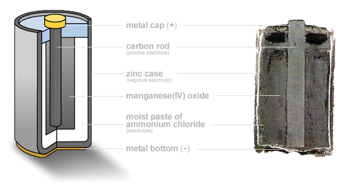
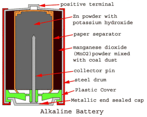
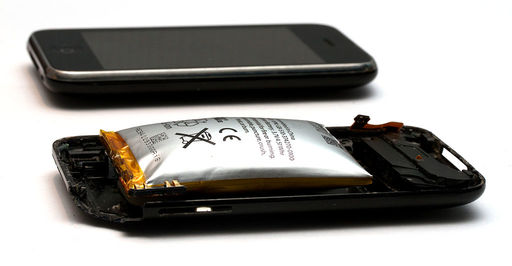
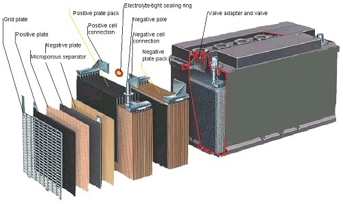
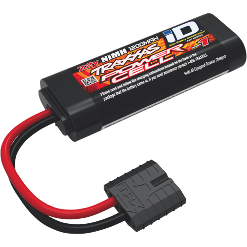

# Electrical Principles
## Battery Chemistries

---

## Zinc Carbon
- Type: Primary cell
- Pros: Cheap and readily avaliable
- Cons: Single-use, short self life
- Voltage: 1.5V
- Usage: Low drain devices, e.g. remote controls, fire alarms, flash lights, clocks 
- Invented 1866, first dry cell

---

## Alkaline Battery
- Type: Primary cell
- Pros: Readily avaliable
- Cons: Single-use, voltage drop during discharge, prone to leak potassium hydroxide, self-discharging 
- Voltage: 1.5V ("discharged" cells have a remaining voltage of between 0.8V-1.0V)
- Usage: Consumer electronics
- Invented in 1955, account for 80% of manufactured batteries

---

## Lithium Polymer (LiPo)
- Type: Secondary cell
- Pros: High energy content, light, can be produced in any shape
- Cons: Physical damage, over charge or too high temperature can cause cells to fail catastrophically (fire, explosion)
- Voltage: 2.7-4.2V
- Usage: personal electronics (laptops, cell phones), RC vehicles, International Space Station (since 2017)
- Invented by Sony in 1991

---

## Lithium Iron Phosphate (LiFePO4 aka LFP)
- Type: Secondary cell
- Pros: Constant discharge voltage, stable and safe (compare to LiPo), many recharge cycles
- Cons: Lower energy density
- Voltage: 3.2V per cell
- Usage: Electric vehicles, power tools, RC vehicles

---

## Lead-Acid Battery
- Type: Secondary cell
- Pros: High energy density, many recharge cycles, cheap
- Cons: Effectiveness reduced at low temperatures, self-discharges, contains lead and concentrated sulfuric acid
- Voltage: 2V per cell
- Usage: Vehicle starter and ignition, backup power supplies (computer UPS units)
- Oldest type of rechargable battery, invented in 1859

---

# NiCd
- Type: Secondary cell
- Pros: Long Shelf life,many recharge cycles, good performance at low temperatures, can produce very large instantaneous currents (1000-8000A for a second)
- Cons: Contains Cadmium (heavy, expensive and toxic), corrosive electrolytes
- Voltage: 1.2V per cell
- Usage: Portable electronic equipment, e.g. flash lights, aircraft and satellite systems, starting large disel engines and turbines.
- Invented in 1899.

---

# Nickel-metal Hydride (NiMH)
- Type: Secondary cell
- Pros: Higher energy content that NiCd
- Cons: Overcharging can rupture battery
- Voltage: 1.4-1.6V
- Usage: Consumer electronics, e.g. RC vehicles

---

# Fuel Cells
- Fuel and oxidant are continuously supplied from the outside while vaste products are removed.
- Pros: High-efficiency of energy conversion, no harmful waste products, no need to recharge
- Cons: Expensive, bulky, complex technology, fuel gases must be stored in high-pressure tanks, moderate power output
- Use: The space shuttle and Apollo space program, military submarines

[Video: What are fuel cells?](https://www.youtube.com/watch?v=Tk_iIzOUjTU) 

---

# Batteries vs. Fuel Cells
- Batteries: Spontaneous chemical reaction generates electricity
- Fuel Cell: Requires a continuous supply of fuel
